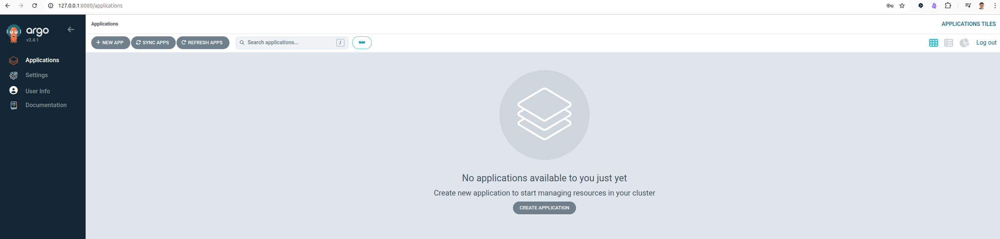
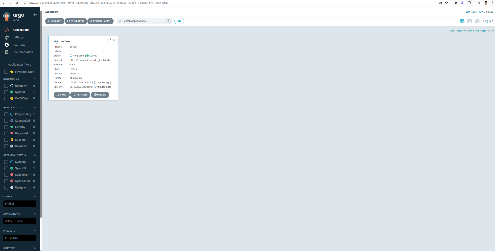
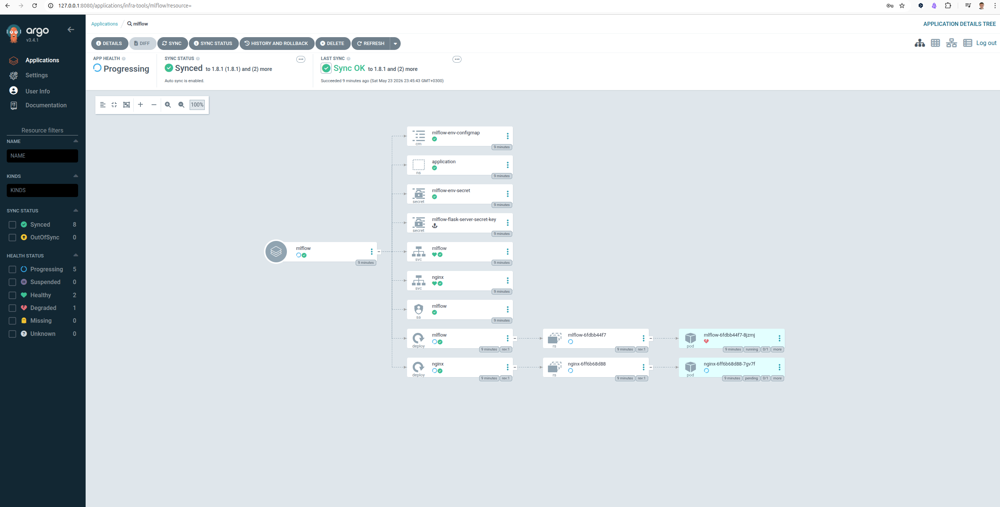
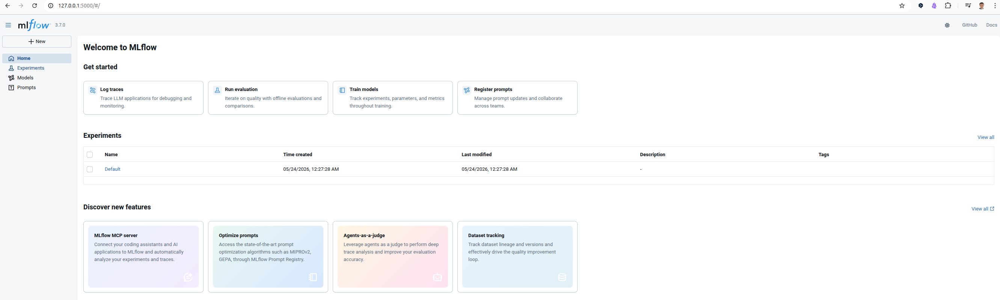

# [Lesson 7 — ArgoCD через Terraform та GitOps-деплой](https://www.edu.goit.global/learn/25315460/38664777/38699501/homework)

Розгортання VPC, EKS-кластера та ArgoCD в AWS. MLflow деплоїться через ArgoCD Application із окремого GitOps-репозиторію `goit-argo`, підключеного як Git submodule.

## Конфігурація за замовчуванням

| Параметр | Значення |
|---|---|
| Region | `us-east-1` |
| AWS Profile | `devops` |
| VPC CIDR | `10.0.0.0/16` |
| Availability Zones | `us-east-1a`, `us-east-1b` |
| Cluster Name | `goit-eks-cluster` |
| Kubernetes Version | `1.33` |
| Instance Type | `t3.micro` |
| ArgoCD Namespace | `infra-tools` |
| ArgoCD Chart Version | `9.5.13` |

## Структура проєкту

```text
goit-devops-lesson-7/
├── main.tf              # Кореневий модуль — викликає vpc, eks і argocd
├── variables.tf         # Всі змінні з defaults
├── outputs.tf
├── terraform.tf         # required_providers + provider aws ~> 5.0 (argocd/ має власний provider.tf з Helm/Kubernetes)
├── backend.tf           # local backend
├── argocd/              # Модуль ArgoCD через Helm chart
│   ├── main.tf
│   ├── variables.tf
│   ├── provider.tf
│   ├── outputs.tf
│   ├── terraform.tf
│   ├── backend.tf
│   └── values/
│       └── argocd-values.yaml
├── vpc/                 # Модуль VPC (terraform-aws-modules/vpc/aws ~> 5.0)
│   ├── main.tf          # NAT gateway, DNS, subnet tags для EKS
│   ├── variables.tf
│   ├── outputs.tf       # vpc_id, private_subnet_ids, public_subnet_ids
│   ├── terraform.tf
│   └── backend.tf
├── eks/                 # Модуль EKS (terraform-aws-modules/eks/aws ~> 20.0)
│   ├── main.tf          # 2 node groups, terraform_remote_state
│   ├── variables.tf
│   ├── outputs.tf       # cluster_name, cluster_endpoint, cluster_certificate_authority_data, cluster_oidc_issuer_url, kubeconfig_command
│   ├── terraform.tf
│   └── backend.tf
├── .gitmodules
└── goit-argo/           # submodule -> git@github.com:nickolas-z/goit-argo.git
```

## Передумови

- Terraform >= 1.3
- AWS CLI налаштований з профілем `devops` (IAM user, не root):

  ```bash
  aws configure --profile devops
  ```

- kubectl
  - Client Version: v1.36.1
  - Kustomize Version: v5.8.1
  - Server Version: v1.33.11-eks-7fcd7ec

## Розгортання

### З кореневої директорії

VPC, EKS та ArgoCD розгортаються з кореневої директорії. VPC outputs передаються в EKS напряму через module outputs, а ArgoCD підключається до створеного EKS-кластера через Kubernetes/Helm providers.

Оскільки `argocd/provider.tf` конфігурує Kubernetes/Helm providers з EKS outputs, при першому запуску Terraform не може ініціалізувати ці providers до того, як кластер стане доступним. Тому **перший deploy завжди двоетапний**:

```bash
terraform init
# Крок 1: підняти інфраструктуру (VPC + EKS)
terraform apply -target=module.vpc -target=module.eks
# Крок 2: повний apply (ArgoCD + решта)
terraform apply
```

> Для повторного apply (кластер вже існує) достатньо одного кроку:
>
> ```bash
> terraform plan
> terraform apply
> ```

## Перевірка після terraform apply

```bash
# 1. Налаштування kubectl
aws eks --region us-east-1 update-kubeconfig --name goit-eks-cluster --profile devops

# 2. Перевірити node groups
kubectl get nodes
```

Приклад виводу — 2 ноди зі статусом `Ready`:

```text
NAME                         STATUS   ROLES    AGE     VERSION
ip-10-0-1-138.ec2.internal   Ready    <none>   3m34s   v1.33.11-eks-7fcd7ec
ip-10-0-2-84.ec2.internal    Ready    <none>   3m14s   v1.33.11-eks-7fcd7ec
```

Перевірити до якої node group належить нода:

```bash
kubectl get nodes -L workload-type,role,topology.kubernetes.io/zone,eks.amazonaws.com/nodegroup
```

Приклад реального результату:

```text
NAME                         STATUS   ROLES    AGE     VERSION                WORKLOAD-TYPE   ROLE     ZONE         NODEGROUP
ip-10-0-1-138.ec2.internal   Ready    <none>   4m27s   v1.33.11-eks-7fcd7ec   cpu             worker   us-east-1a   cpu-nodes-20260515202646319800000018
ip-10-0-2-84.ec2.internal    Ready    <none>   4m7s    v1.33.11-eks-7fcd7ec   gpu             worker   us-east-1b   gpu-nodes-20260515202646319500000016
```

### Перевірити ArgoCD

```bash
kubectl get pods -n infra-tools
kubectl get svc -n infra-tools
```
Приклад реального результату:

```text
❯ kubectl get pods -n infra-tools
NAME                                                READY   STATUS    RESTARTS       AGE
argocd-application-controller-0                     1/1     Running   0              3m14s
argocd-applicationset-controller-78bcd8564f-k28xq   1/1     Running   0              3m15s
argocd-dex-server-7ccb4b765b-ltwnc                  1/1     Running   2 (3m4s ago)   3m15s
argocd-redis-d6bcfc99c-tqnxk                        1/1     Running   0              3m15s
argocd-repo-server-5d8d78598-v7kt5                  1/1     Running   0              3m15s
argocd-server-69dbb986f6-ks2xq                      1/1     Running   0              3m15s

❯ kubectl get svc -n infra-tools
NAME                               TYPE        CLUSTER-IP       EXTERNAL-IP   PORT(S)             AGE
argocd-applicationset-controller   ClusterIP   172.20.128.244   <none>        7000/TCP            3m27s
argocd-dex-server                  ClusterIP   172.20.98.14     <none>        5556/TCP,5557/TCP   3m27s
argocd-redis                       ClusterIP   172.20.217.249   <none>        6379/TCP            3m27s
argocd-repo-server                 ClusterIP   172.20.31.186    <none>        8081/TCP            3m27s
argocd-server                      ClusterIP   172.20.188.30    <none>        80/TCP,443/TCP      3m27s
```

Отримати початковий пароль користувача `admin`:

```bash
kubectl -n infra-tools get secret argocd-initial-admin-secret -o jsonpath='{.data.password}' | base64 -d
```

Відкрити ArgoCD UI локально:

```bash
kubectl -n infra-tools port-forward svc/argocd-server 8080:80
```

Після цього UI буде доступний на `http://localhost:8080`.


## GitOps submodule

[`goit-argo`](https://github.com/nickolas-z/goit-argo) підключений як submodule і є джерелом правди для ArgoCD Application та Helm values.

Ініціалізувати submodule після нового clone:

```bash
git submodule update --init --recursive
```

Підтягнути останні зміни з GitOps-репозиторію:

```bash
git submodule update --remote --merge goit-argo
```

Після оновлення submodule pointer потрібно зафіксувати його в parent repo:

```bash
git add .gitmodules goit-argo
git commit -m "Update goit-argo submodule"
```

## MLflow через ArgoCD

Application описаний у `goit-argo/application.yaml`. Він використовує Helm chart `mlflow` з `https://community-charts.github.io/helm-charts`, а overrides бере з `goit-argo/values/mlflow-values.yaml` через ArgoCD multiple sources.

Застосувати Application:

```bash
kubectl apply -f goit-argo/application.yaml
```
Перевірити Application:

```bash
kubectl get applications -n infra-tools
```
Приклад реального результату:

```text
❯ kubectl get applications -n infra-tools
NAME     SYNC STATUS   HEALTH STATUS
mlflow   Synced        Progressing
```



Дочекатися синхронізації та перевірити MLflow:

```bash
kubectl get pods -n application
kubectl get svc -n application
```
Приклад реального результату:

```text
❯ kubectl get pods -n application
NAME                     READY   STATUS    RESTARTS      AGE
mlflow-6fdbb44f7-8jzmj   0/1     Running   1 (65s ago)   2m14s
nginx-6ff6b68d88-7gv7f   0/1     Pending   0             2m14s

❯ kubectl get svc -n application 
NAME     TYPE        CLUSTER-IP       EXTERNAL-IP   PORT(S)    AGE
mlflow   ClusterIP   172.20.126.170   <none>        5000/TCP   2m34s
nginx    ClusterIP   172.20.42.142    <none>        80/TCP     2m34s
```

Відкрити MLflow локально:

```bash
kubectl -n application port-forward svc/mlflow 5000:5000
```

Після цього MLflow буде доступний на `http://localhost:5000`.


## Node Groups

| Node Group | Instance Type | Labels | Taints |
|---|---|---|---|
| `cpu-nodes` | `t3.micro` | `workload-type=cpu`, `role=worker` | — |
| `gpu-nodes` | `t3.micro` | `workload-type=gpu`, `role=worker` | `nvidia.com/gpu=true:NoSchedule` |

> **Примітка:** Обидві групи використовують `t3.micro` (Free Tier). Для реальних GPU-задач треба замінити на `g4dn.xlarge` або подібний instance type.

## Кастомізація

```bash
# Змінити AWS профіль
terraform apply -var="aws_profile=devops"

# Змінити розмір кластера
terraform apply -var="desired_size=2" -var="max_size=3"

# Змінити Kubernetes версію
terraform apply -var="kubernetes_version=1.33"
```

## Знищення інфраструктури

```bash
terraform destroy
```
Приклад реального результату:

```text
Destroy complete! Resources: 24 destroyed.
```